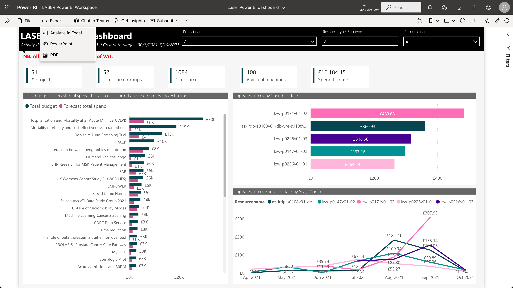
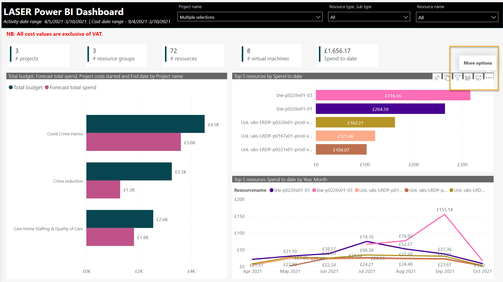
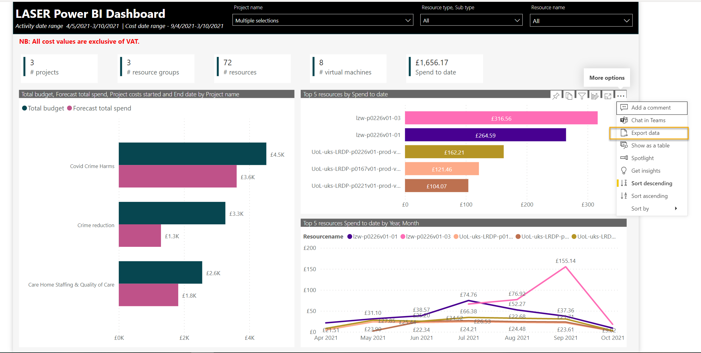

# How to export the Power Bi Report 

It is possible to export the report data, select the Export option at the top of the report.

  
- [Analyze in Excel using Power BI](https://docs.microsoft.com/en-us/power-bi/collaborate-share/service-analyze-in-excel)
- [Export data to PDF](https://docs.microsoft.com/en-us/power-bi/consumer/end-user-pdf)
- [Export data to Power Point](https://docs.microsoft.com/en-us/power-bi/consumer/end-user-powerpoint)

## How to export specific data

By default all visuals have the capability for you to export the associated data. 

1. Click on more options

	

2. Click on Export data

	

3. A window such as detailed below will appear

	

	- There will then be two or three options available: Summarized data, Underlying data and occasionally Data with current layout

	**Summarized data** has two types of file formats and different size limits.

	**Underlying data** uses only .csv file format with 30,000 max rows limitation.

	**Data with current layout** is a new option as of November 2021 that allows the export of data from a table or matrix visual to Excel while preserving the formatting.

For more info on export data follow this link: [power-bi-visualization-export-data](https://docs.microsoft.com/en-us/power-bi/visuals/power-bi-visualization-export-data)
