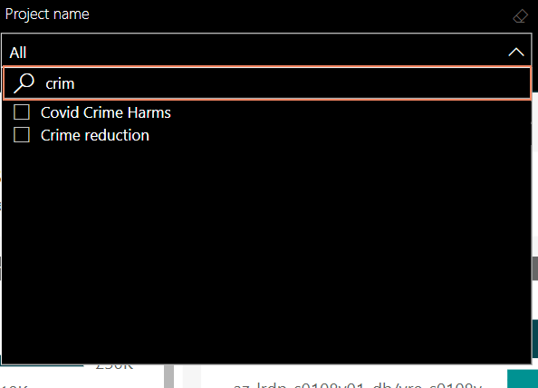
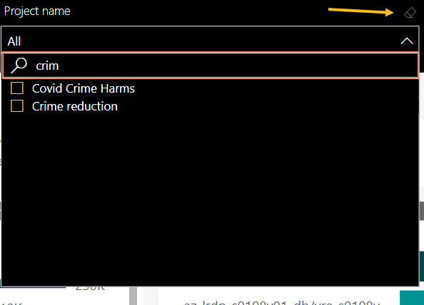
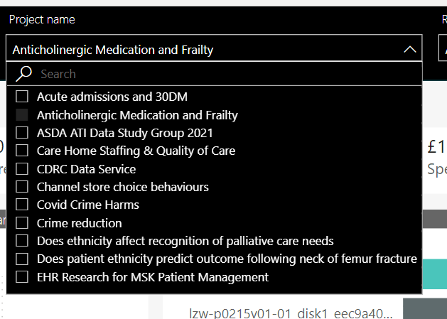

# Working with Slicers
{:.no_toc}

* seed list
{:toc}

Slicers in Power BI are used for cross filtering data.

- In this report all slicers by default cross filter the rest of the visuals. Every slicer has the functionality to search. 
	
- Clear the slicer by using the eraser option. 
	
- Single select on Slicer 
	Single mouse click selects one item.
	
- Multi select on slicers
	CTRL + Click to multi select items.
	
