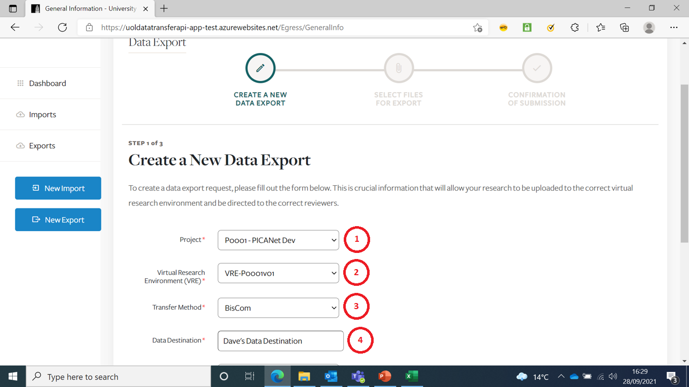
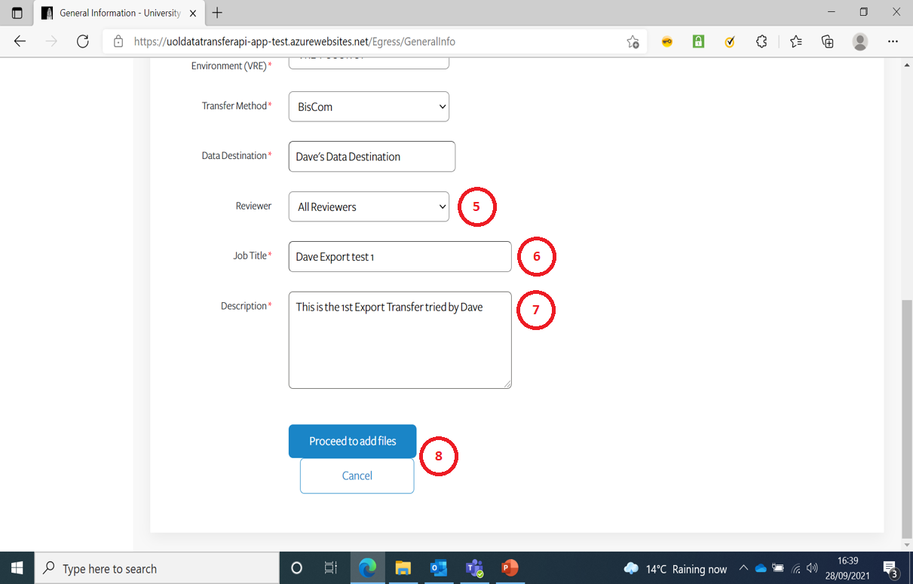
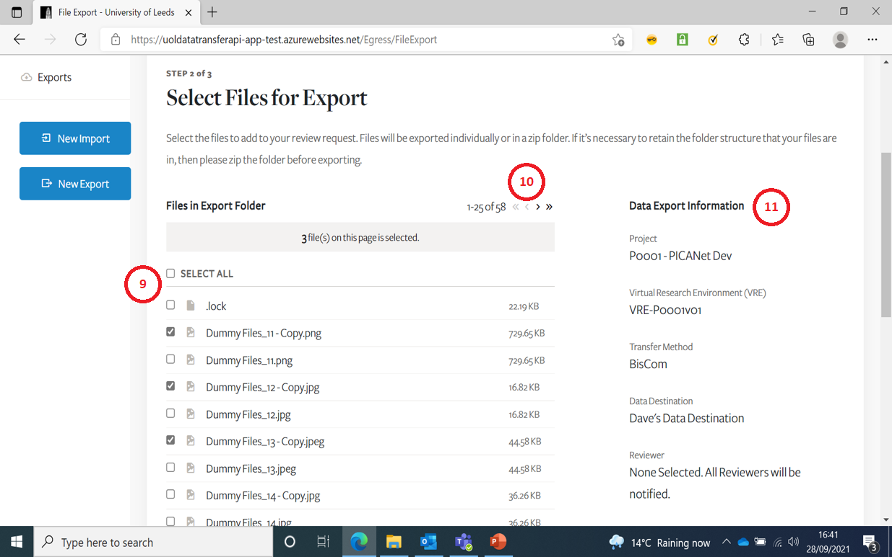
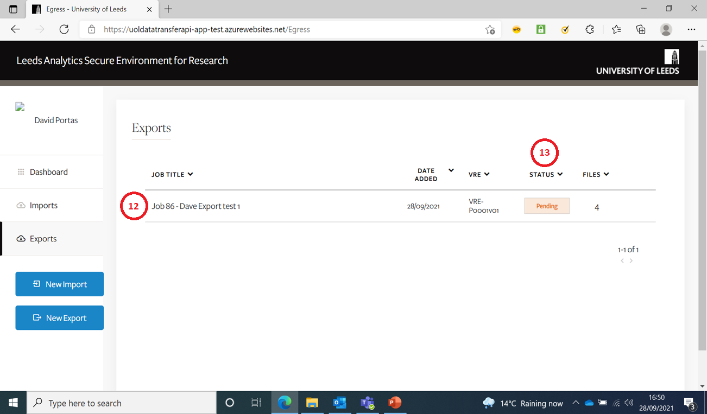

# Export Files from a VRE
{:.no_toc}

* seed list
{:toc}

## Create New Export Job Request 

This is the Create New Export page.  
You have to select an item from the drop-downs when prompted.  

|:---:|---|
|1|You should only be presented with Projects you are associated with|
|2|You should only be presented with VRE’s associated with the Project you selected|
|3|There are only 3 possible Transfer Methods|
|4|Data Destination is a free-form text box|

|:---:|---|
|5|Version 1 of the App will default to All Reviewers|
|6|Enter a meaningful short title for the Job|
|7|Enter a meaningful description for the Job|
|8|Either Proceed or Cancel (to go back to previous page)|

## Select Files To Upload

All files present in the root of /Export file share of the VRE will be available to select.  
Any files types can be uploaded except empty files.  
Folders cannot be uploaded.  
There is no max file/job size limit - the system has been tested to upload 30GB.  

|:---:|---|
|9|You can select one or more files for further action|
|10|Max 25 files are listed per page, but you can scroll or fast forward/backward to other pages of files|
|11|This pane summarises details of the Job|

Press ‘Add files for export’ once you are happy with your selections (You will receive one more confirmation prompt after this).  

## See Export Job in Dashboard Screen

If you go back to the Dashboard screen your Export Job(s) should be listed.  

|:---:|---|
|12|Your  Export Jobs should be listed in order of Date Added (Created)|
|13|The Status column lets you know if your Job is ‘Pending’ review, or has been reviewed and been ‘Approved’ or ‘Rejected’|

