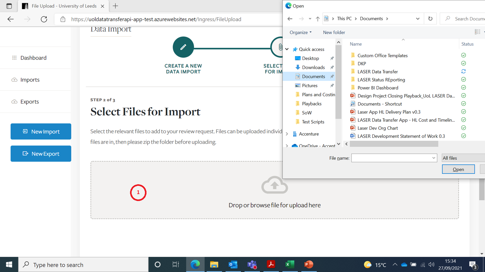
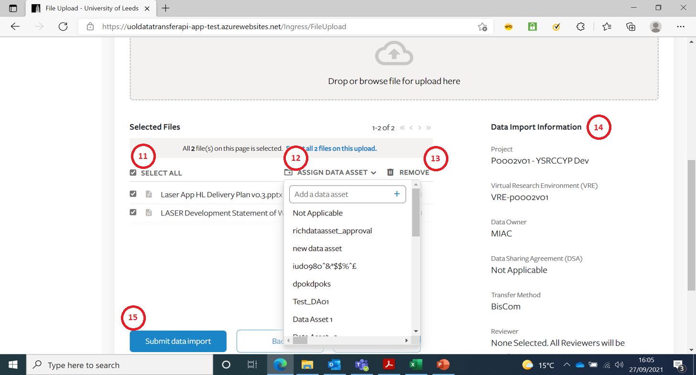
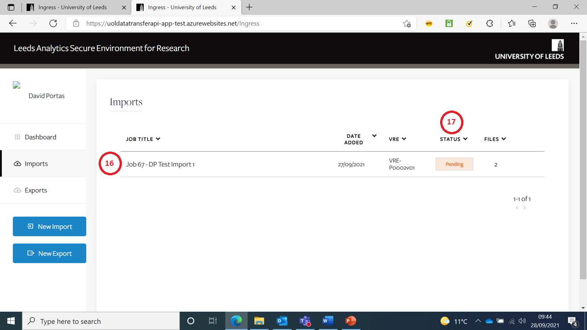

# Import Files into a VRE
{:.no_toc}

* seed list
{:toc}

## Create New Import Job Request

This is the Create New Import page.  
You have to select an item from the drop-downs when prompted.

1. You should only be presented with Projects you are associated with
2. You should only be presented with VRE’s associated with the Project you selected
3. If Data Owner is not known, select 'N/A'
4. Data Sharing Agreement can be 'N/A' (if Data Owner is 'N/A'

	

5. There are only 3 possible Transfer Methods 
6. Version 1 of the App will default to All Reviewers
7. Enter a meaningful short title for the Job
8. Enter a meaningful description for the Job
9. Either Proceed or Cancel (to go back to previous page)

## Select files to Upload

Any files types can be uploaded except empty files.  
Folders cannot be uploaded.  
There is no max file/job size limit - the system has been tested to upload 30GB.  

1. Click here to open a file selector or drag & drop files.

## Confirm files and submit job

1. You can select one or more files for further action
2. You can change or add a new Data Asset
3. This allows you to remove files uploaded in error
4. This pane summarises details of the Job
5. Press ‘Submit’ once you are happy with your selections(You will receive one more confirmation prompt after this)

## See Import Job in Dashboard Screen

If you go back to the Dashboard screen your Import Job(s) should be listed.  

1. Your Import Jobs should be listed in order of Date Added (Created)
2. The Status column lets you know if your Job is ‘Pending’ review, or has been reviewed and been ‘Approved’ or ‘Rejected’

