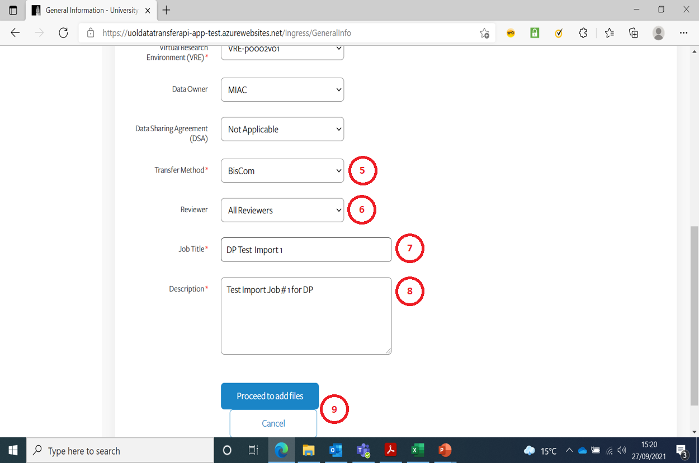

# Create New Import Job

This is the Create New Import page.  
You have to select an item from the drop-downs when prompted.

1. You should only be presented with Projects you are associated with
2. You should only be presented with VRE’s associated with the Project you selected
3. If Data Owner is not known, select 'N/A'
4. Data Sharing Agreement can be 'N/A' (if Data Owner is 'N/A'

	

5. There are only 3 possible Transfer Methods 
6. Version 1 of the App will default to All Reviewers
7. Enter a meaningful short title for the Job
8. Enter a meaningful description for the Job
9. Either Proceed or Cancel (to go back to previous page)
