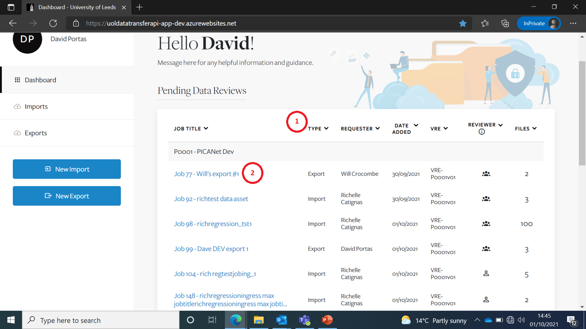
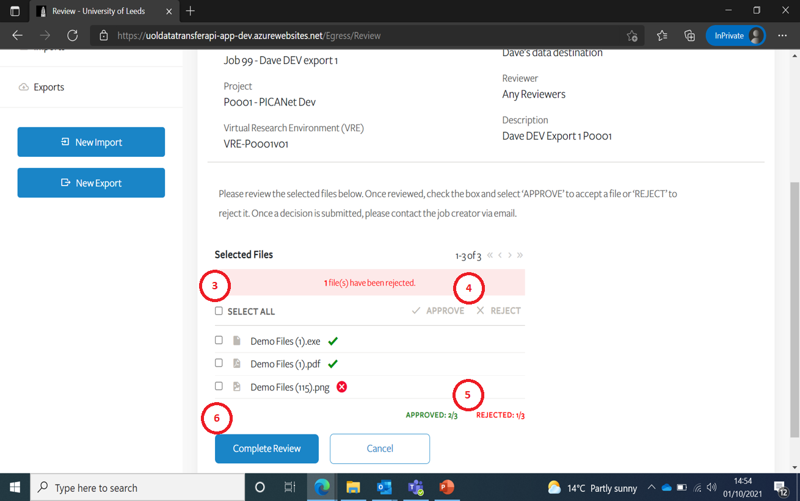

# Reviewing an Import or Export Job
{:.no_toc}

* seed list
{:toc}

## Create New Export Job Request 

On the Dashboard screen, if you are a Reviewer, the review Jobs will be listed at the top.  

|Item|Description|
|:---:|---|
|1|You can sort the Jobs using the various sort icons|
|2|To review a Job, just click on the Job Title link|

## Reviewing files within a Job

If you go back to the Dashboard screen the Import and Export Jobs you are allowed to review are listed.  

|Item|Description|
|:---:|---|
|3|You can select ‘All’ or individual files|
|4|You can either Approve or Reject files by clicking on one of these two icons|
|5|A running total of Approved & Rejected files is provided here|
|6|You will only be able to ‘Complete Review’ once all files have been either Approved or Rejected|

