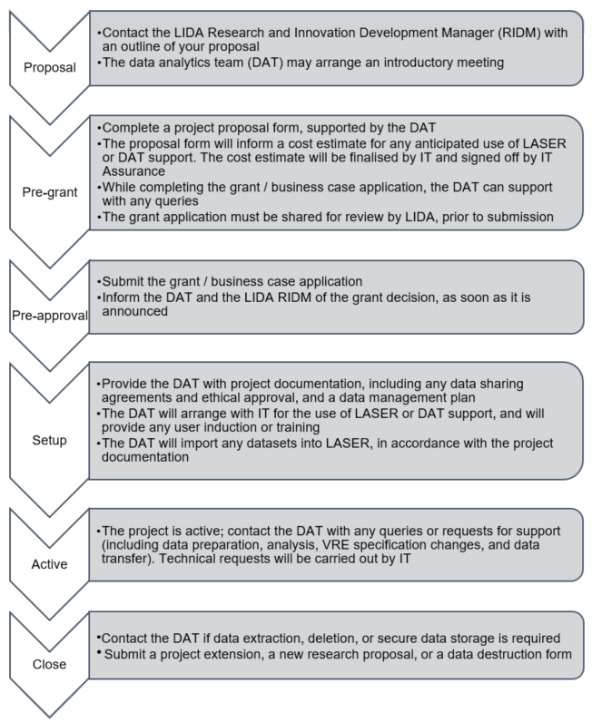

# LIDA Research Management Process

When you, as a researcher, approach LIDA with a project proposal with intent of using LASER and or DAT support, it goes through a 6-stage Research Management Process (RMP). This process guides the project from proposal to completion, including securing funding, approvals, conducting research, and properly closing the project with data handling measures.  

## RMP Stages in details:

1. **Proposal:**
   - Contact LIDA Research and Innovation Development Manager(Jodi Gunning) or DAT with your research proposal/idea.
   - If aligned with LIDA's portfolio, the Data Analytics Team (DAT) will arrange an introductory meeting.
   - DAT will issue you a LASER specific proposal template, which you should complete and return to DAT.
   - If a project is applying for grant proceed to step 3. If project is already funded, proceed to step 4.

2. **Pre-grant:**
   - DAT provides a project proposal form and guidance.
   - Capture data classification, regulatory compliance, computational resources, and collaboration plans.
   - If using LASER, DAT will estimate costs for inclusion in your grant proposal.

3. **Pre-approval:**
   - After submitting the grant application, the project is in the Pre-approval stage.
   - Contact DAT for queries and to move the project to the Setup stage upon successful funding.

4. **Setup:**
   - DAT guides in providing a Data Management Plan, ethical approval, Data Sharing Agreements, and Data Protection Impact Assessment.
   - Risk assessment and IT Assurance review.
   - DAT facilitates the TRE setup/build process with the University IT services, user agreements, security training.

5. **Active:**
   - The TRE is handed over to research team and assists in initial file import into the environment.
   - DAT provides LASER induction training for users and support in accessing LASER.
   - Researchers conduct project research on LASER.
   - DAT assists in data transfer, destruction, analytics, and other software and technical support.

6. **Close:**
   - Prior to the project end date, DAT requests a status update from reseachers.
   - Researchers may choose to destroy or extend the VRE, subject to funding and DSA.
   - If destroying, arrange for data extraction, complete a VRE destruction request, and confirm destruction with DAT.
   - If extending, the project returns to the Proposal stage.

## RMP stages in Brief:

 
